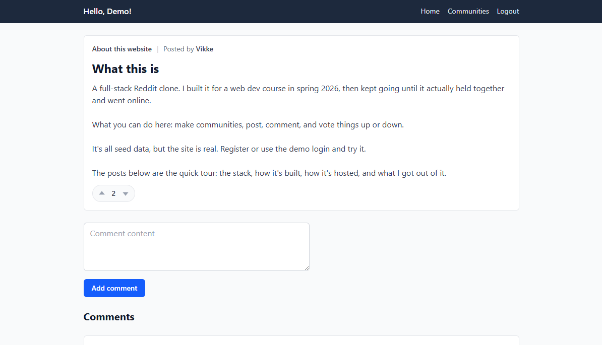
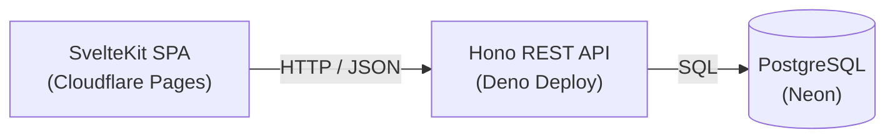

# Reddit clone

A full-stack Reddit-style forum where users create communities, post, comment in threads, and vote. A SvelteKit frontend talks to a Deno REST API backed by PostgreSQL.

**Live demo:** https://fullstack-reddit-clone-794.pages.dev/



## Background

This started as the term project for a full-stack web development course (spring 2026). After the course ended I kept working on it instead of leaving it as a graded exercise. Since then I have fixed a long list of bugs, added usernames and voting, reworked how the client and server stay in sync, and deployed the whole thing so it runs online rather than only locally.

Two goals drove that work: turn a course assignment into something a person can actually use, and learn the parts the course did not cover, such as hosting a multi-service app for free and debugging it in production.

## What it does

- Register and log in. Passwords are hashed with scrypt; sessions are stateless JWTs sent as Bearer tokens.
- Create communities, then create and delete posts inside them.
- Comment on posts and vote posts and comments up or down. Each user gets one vote per item, and clicking the same arrow again removes the vote.
- A homepage that collects recent posts across communities, each showing its community, author, score, and comment count.

## Tech stack

| Layer | Choice | Notes |
|-------|--------|-------|
| Frontend | SvelteKit (Svelte 5), Tailwind CSS v4 | Single-page app. Reactivity uses Svelte 5 runes. |
| API | Deno + Hono | Small, fast REST API. The same app object runs locally and when deployed. |
| Database | PostgreSQL, queried with postgres.js | Parameterized queries throughout. |
| Migrations | Flyway | Schema changes are versioned (V1 to V9). |
| Tests | Playwright | End-to-end tests against a running stack. |
| Local dev | Docker Compose | One command boots the client, API, database, and migrations. |
| Hosting | Neon, Deno Deploy, Cloudflare Pages | Database, API, and frontend on three free tiers. The frontend and API redeploy on every push to main. |

## Architecture

Three services talk to each other over HTTP and SQL:



The API is layered. Routes map to controllers, which handle the request and call repositories, which hold the SQL. Nothing above the repository layer writes queries, so the data access stays in one place.

A couple of schema decisions worth pointing out:

- **Comments are posts.** A comment is a row in the `posts` table with a `parent_post_id` pointing at the post it belongs to. One self-referential table instead of two.
- **A vote is a row** in a `votes` table keyed by `(user_id, post_id)`, with a unique constraint so a user can vote once per item. Deleting a post cascades to its comments and votes.

Authentication is stateless. You log in, get a signed token, and every protected request carries it. The server verifies the signature and keeps no session of its own. Public reads (the homepage, a post) still read your token when it is present, so the API can tell you which way you voted without requiring login to view anything.

## Concepts demonstrated

REST API design, layered architecture, the repository pattern, CRUD across communities and posts, relational schema design with a normalized self-referential table, database migrations, parameterized queries (safe against SQL injection), JWT authentication with hashed passwords, end-to-end testing, containerized local development, and push-to-deploy hosting.

## Running locally

You need Docker.

```bash
docker compose up
```

That starts the frontend on `http://localhost:5173`, the API on `http://localhost:8000`, a PostgreSQL container, and the Flyway migrations, which run automatically.

To fill the database with demo content (communities, posts, comments, votes, and a demo user), run the seed script inside the server container:

```bash
docker compose exec server deno run --allow-env --allow-net seed.js
```

## Testing

Playwright end-to-end tests run against the full stack and cover the core flows: authentication, creating and deleting communities, post creation, voting, and removal, and the same for comments.

```bash
cd e2e-tests && npx playwright test
```

## Project structure

```
client/               SvelteKit single-page frontend
server/               Deno + Hono REST API
  controllers/        request handling
  repositories/       database queries
  seed.js             demo data
database-migrations/  Flyway SQL migrations (V1..V9)
e2e-tests/            Playwright tests
compose.yaml          local dev: client, API, postgres, migrations
```

## Possible improvements

- Run the Playwright tests in CI on every push, not only the deploy.
- Paginate the homepage and community feeds instead of loading every post.
- Add role-based access control so community owners can moderate posts and comments, not just their own.
